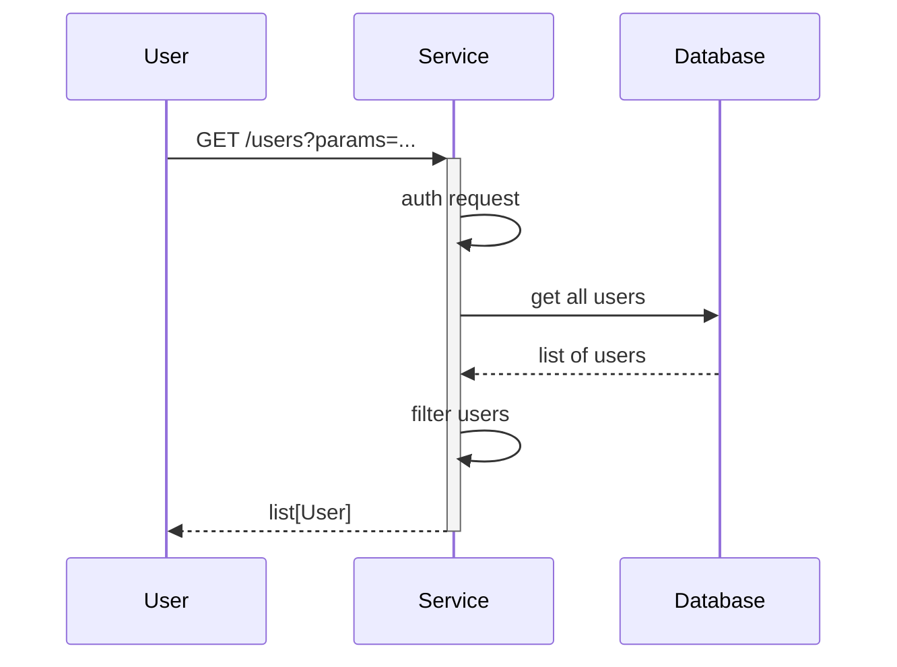

# Clinical Data Pathology API

[](https://github.com/NHSDigital/clinical-data-pathology-api/actions/workflows/cicd-1-pull-request.yaml)
[](https://sonarcloud.io/summary/new_code?id=NHSDigital_clinical-data-pathology-api)

Repository housing all code responsible for handling the Clinical Data Pathology APIs. This repository houses the various Python modules responsible for managing logic within the APIs, as well as all the Terraform code responsible for deploying the APIs within an environment.

The Pathology and Laboratory Reporting - FHIR APIs look to provide a replacement for the existing [PMIP EDIFACT](https://digital.nhs.uk/developer/api-catalogue/pathology-messaging-edifact) flows for providing test results, implemented utilising the [Pathology FHIR Implementation Guide](https://simplifier.net/guide/pathology-fhir-implementation-guide/Home). This implementation guide provides an implementation of the [DAPB4101: Pathology and Laboratory Medicine Reporting Information Standard](https://digital.nhs.uk/data-and-information/information-standards/governance/latest-activity/standards-and-collections/dapb4101-pathology-and-laboratory-medicine-reporting-information-standard).

## Table of Contents

- [Clinical Data Pathology API](#clinical-data-pathology-api)
  - [Table of Contents](#table-of-contents)
  - [Setup](#setup)
    - [Prerequisites](#prerequisites)
    - [Configuration](#configuration)
  - [Usage](#usage)
    - [Testing](#testing)
  - [Design](#design)
    - [Diagrams](#diagrams)
    - [Modularity](#modularity)
  - [Contributing](#contributing)
  - [Contacts](#contacts)
  - [Licence](#licence)

## Setup

Clone the repository.

```shell
git clone git@github.com:NHSDigital/clinical-data-pathology-api.git
cd clinical-data-pathology-api.git
```

The project can then be built within a [Dev Container](https://containers.dev/) as defined within the file outlined under `.devcontainer/devcontainer.json`. When opening the project within Visual Studio Code, if the [Dev Containers extension](https://marketplace.visualstudio.com/items?itemName=ms-vscode-remote.remote-containers) is installed, you should be prompted to re-open the folder within a Dev Container if you wish. If accepted, this should build the Dev Container locally which will include all required libraries and tools for development.

> [!NOTE]<br>
> If any additional certificates need to be trusted when building locally, these can be added to the `infrastructure/images/build-container/resources/dev-certificates` directory. These certificates will then automatically be trusted by the build container when the `INCLUDE_DEV_CERTS` docker build argument is set to `true`.
>
> If running in Windows Subsystem for Linux (WSL) on Windows the vscode Dev containers extension should be configured to use WSL {"dev.containers.executeInWSL": true}.
> It is also necessary for the repository to be cloned into the WSL filesystem and on the first build of the container (and any subsequent complete rebuilds without cache). vscode should then be connected to WSL, before subsequently opening the repository folder. The container can then be built as described above.

### Prerequisites

The following software packages, or their equivalents, are expected to be installed and configured:

- A container manager for running containers locally, such as [Colima](https://github.com/abiosoft/colima) on Mac OS, or [Docker](https://docs.docker.com/engine/install/) within WSL on Windows or Linux natively.

### Configuration

Installation and configuration of the toolchain dependencies is completed as part of building the Dev container as described above.

## Usage

Once the build container has been built and is up and running, A few different `make` targets are provided for installing dependencies and building the codebase.

- `dependencies` - installs all dependencies required for the project
- `build` - builds the codebase so that it is ready for deployment
- `deploy` - builds the codebase and deploys it within a separate container locally.
- `clean` - stops and removes any containers outside of the Dev container locally.

### Testing

There are `make` tasks for you to configure to run your tests.  Run `make test` to see how they work.  You should be able to use the same entry points for local development as in your CI pipeline.

#### Continuous Integration

More documentation on the GitHub actions utilised to support continuous integration can be found on the [Continuous Integration](./.github/github_actions.md) page.

## Design

### Diagrams

The [C4 model](https://c4model.com/) is a simple and intuitive way to create software architecture diagrams that are clear, consistent, scalable and most importantly collaborative. This should result in documenting all the system interfaces, external dependencies and integration points.


The source for diagrams should be in Git for change control and review purposes. Recommendations are [draw.io](https://app.diagrams.net/) (example above in [docs](.docs/diagrams/) folder) and [Mermaids](https://github.com/mermaid-js/mermaid). Here is an example Mermaids sequence diagram:



### Modularity

Most of the projects are built with customisability and extendability in mind. At a minimum, this can be achieved by implementing service level configuration options and settings. The intention of this section is to show how this can be used. If the system processes data, you could mention here for example how the input is prepared for testing - anonymised, synthetic or live data.

## Contributing

Describe or link templates on how to raise an issue, feature request or make a contribution to the codebase. Reference the other documentation files, like

- Environment setup for contribution, i.e. `CONTRIBUTING.md`
- Coding standards, branching, linting, practices for development and testing
- Release process, versioning, changelog
- Backlog, board, roadmap, ways of working
- High-level requirements, guiding principles, decision records, etc.

### Signed Commits

To be able to contribute to the repository, any commits created need to be signed. See the [commit signing setup guide page](https://github.com/NHSDigital/software-engineering-quality-framework/blob/main/practices/guides/commit-signing.md) for guidance on setting up this up.

## Contacts

Provide a way to contact the owners of this project. It can be a team, an individual or information on the means of getting in touch via active communication channels, e.g. opening a GitHub discussion, raising an issue, etc.

## Licence

> The [LICENCE.md](./LICENCE.md) file will need to be updated with the correct year and owner

Unless stated otherwise, the codebase is released under the MIT License. This covers both the codebase and any sample code in the documentation.

Any HTML or Markdown documentation is [© Crown Copyright](https://www.nationalarchives.gov.uk/information-management/re-using-public-sector-information/uk-government-licensing-framework/crown-copyright/) and available under the terms of the [Open Government Licence v3.0](https://www.nationalarchives.gov.uk/doc/open-government-licence/version/3/)
