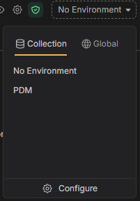
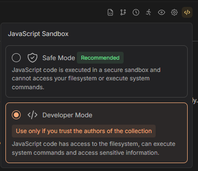

# Developer Guide: Bruno

## Installation

### Windows

On windows you can download the app from the [Bruno website](https://www.usebruno.com/downloads)

### Mac

On mac you can either download from the Bruno Website or you can install the app using Homebrew using the command `brew install bruno`

## Usage

Using the Bruno UI, Open the collection you want to interact with from the repository.

NOTE - if you have cloned your repository in wsl, you can type `\\wsl.localhost\Ubuntu\home\` into the address bar to search your wsl directory

Select the Bruno environment you want to use for the collection, there maybe multiple environments for a collection, this will be defined as part of the code in the collection.

For some hidden values you will need to populate them yourself

Some modules may have custom scripts to run before/after requests, if these script require external dependencies then you will need to install these using `npm install` in the directory of the collection. For requests using external libraries or using the file system you will need to make sure Bruno is running in developer mode.

